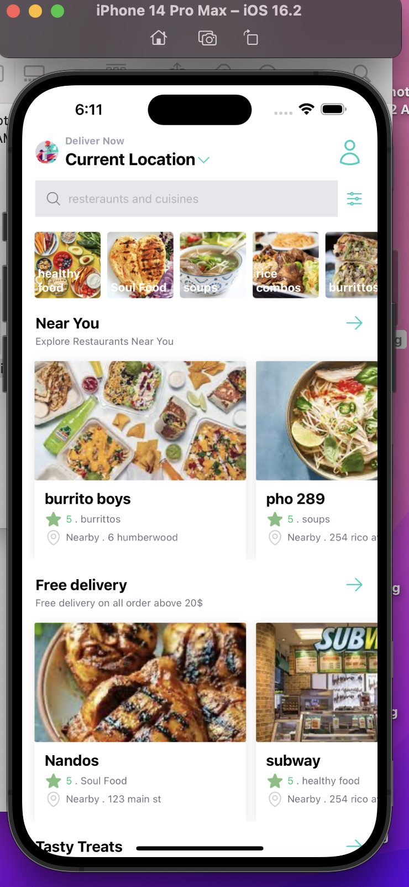
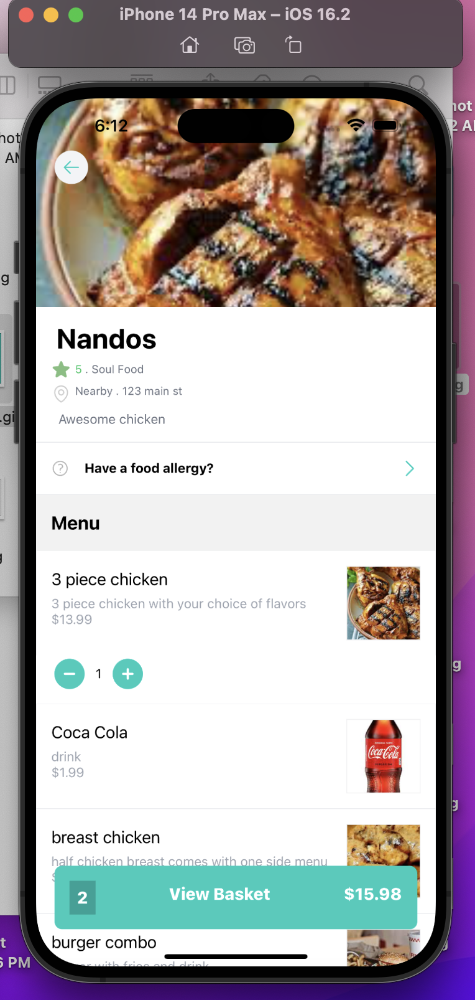

# Deliveroo Clone

This is a Deliveroo clone built using React Native, Redux, and Tailwind CSS. It includes a backend CMS for managing restaurant data.

## Features

- Browse restaurants and their menus
- Add items to the basket
- Remove items from the basket
- Place orders
-  Restaurant management using Sanity CMS

## Technologies Used

- React Native
- Redux
- Tailwind CSS
- Sanity CMS

## Screenshots

